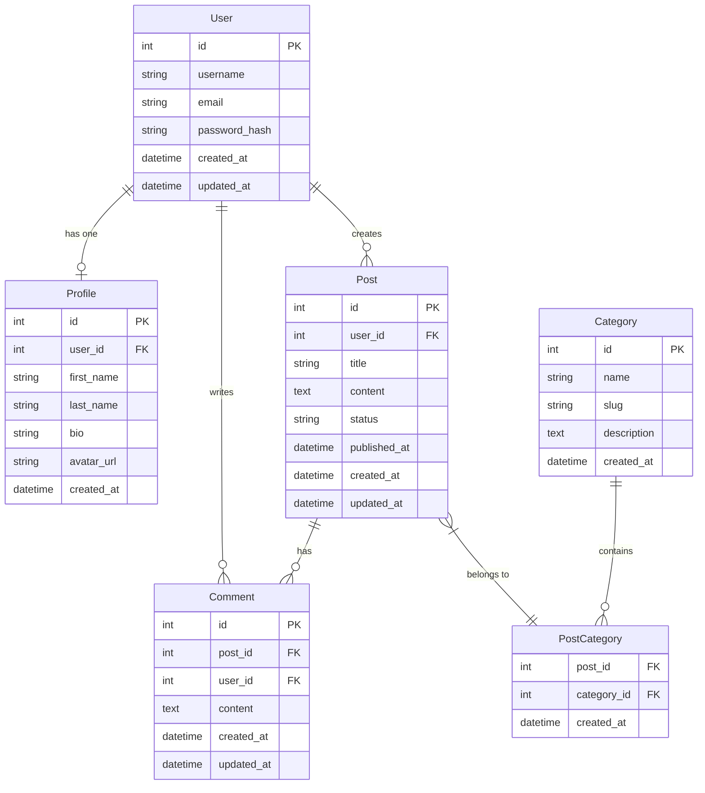

# Test Plan: ER Diagram Viewer Requirements

This test plan outlines the manual steps to validate the functionality of an ER diagram viewer.

1. **Open the application.** Confirm that the Mermaid script input interface is visible.
2. **Paste the Mermaid script.** Use the default example script provided below.

3. **Render the diagram.** Click the "Render Diagram" button and confirm that the diagram appears correctly.
4. **Test table selection.** Click on the "User" table. Confirm that only the `User` table and its directly connected tables (`Profile`, `Post`, `Comment`) are highlighted, while others are de-emphasized.
5. **Verify relationship display.** Confirm that only the relationships corresponding to the "User" table are displayed below the diagram.
6. **Test another table.** Click a different table, such as "Post," and confirm that the highlighting and relationship display update accordingly.
7. **Clear selection.** Click the "Clear Selection" button. Confirm that all tables return to their normal state and all relationships are visible again.
8. **Test edge cases.** Use an edge-case script, such as one for a table with no relationships, and confirm the application behaves correctly.
